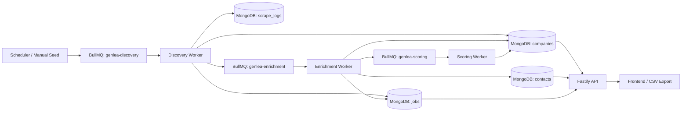
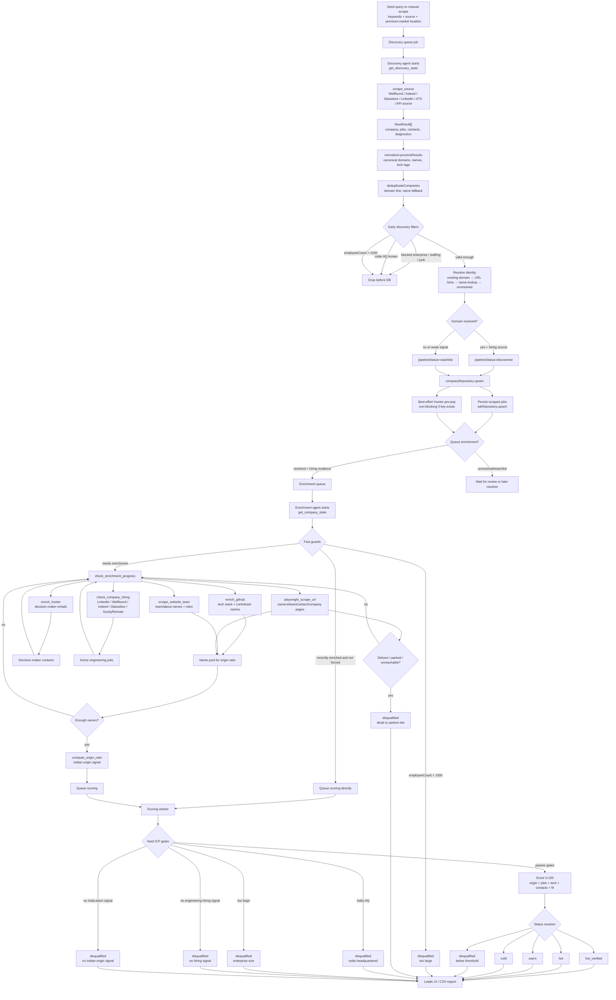
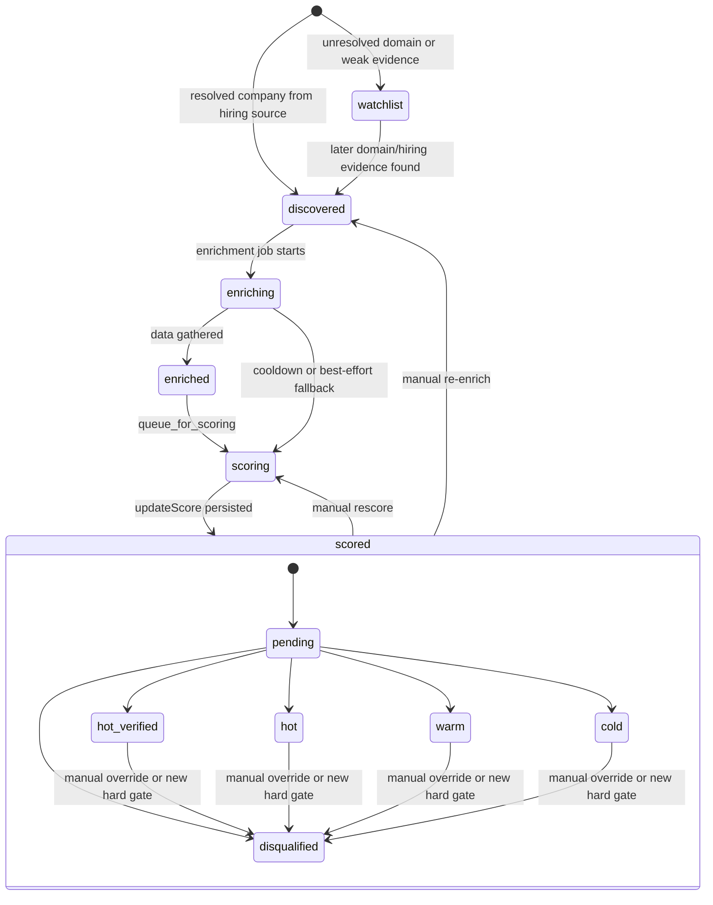
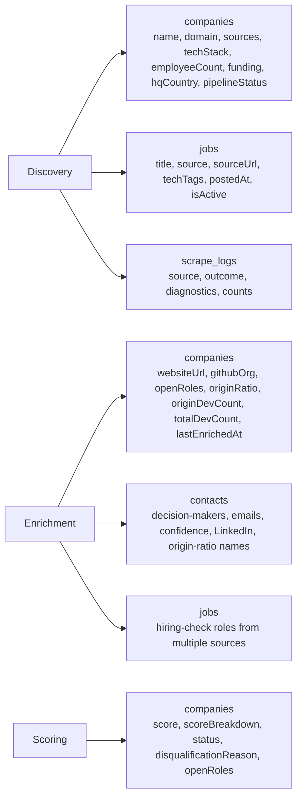
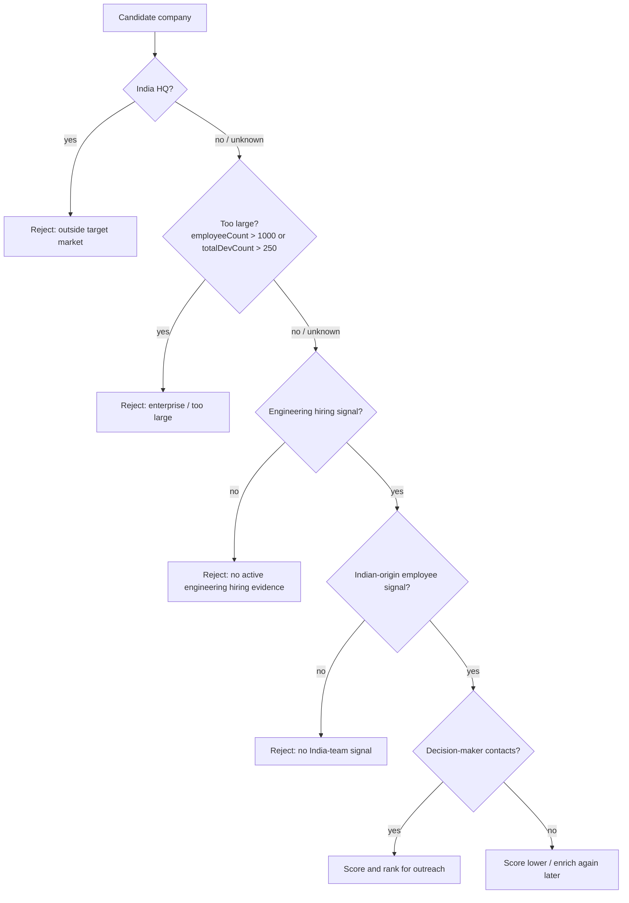

# GenLea — Architecture

> B2B lead-gen engine for software-services outreach. Discovers non-India companies in higher-paying markets that are hiring engineers, show Indian-origin team signals, and have decision-maker contacts.

---

## System overview



All state lives in MongoDB. Queues are Redis-backed (BullMQ). Workers are stateless — you can run multiples.

---

## Journey of a Lead

This is the full lifecycle of one company from “raw search result” to “pitchable lead” or “disqualified lead.”



### Lead State Machine

`pipelineStatus` tracks where the record is in the processing lifecycle. `status` tracks whether it is worth outreach.



### Data Written Along the Way



### Why a Lead Can Be Rejected



The scoring worker keeps disqualification reasons explicit so the frontend can show why a lead failed instead of only showing `disqualified`.

---

## Directory structure

```
genlea-backend/
├── src/                         — main entry point (monolith workers + API)
│   ├── agents/                  — LLM agent entrypoints for discovery + enrichment
│   ├── api/                     — Fastify REST API + Bull Board + inline dashboard
│   ├── core/                    — browser pool, queue manager, proxy/session managers
│   ├── discovery/               — blocklists, source health tracking
│   ├── enrichment/              — normalizer, deduplicator, email verifier, contact resolver
│   ├── scoring/                 — rules.ts + scorer.ts
│   ├── scrapers/                — one file per source (discovery/ and enrichment/ subdirs)
│   ├── storage/                 — MongoDB client + repositories
│   ├── types/                   — shared TypeScript types (monolith)
│   ├── utils/                   — logger, helpers, LLM client
│   └── workers/                 — discovery.worker, enrichment.worker, scoring.worker
│
├── packages/
│   └── shared/                  — @genlea/shared: types, repos, queue, agent framework
│       └── src/
│           ├── agent/           — dom-summarizer, memory, planner, executor, agent-loop
│           ├── enrichment/      — normalizer, deduplicator
│           ├── storage/         — repositories (re-exported)
│           ├── utils/           — llm.client, logger
│           └── scheduler.ts     — seed queries + enqueueSeedRound
│
├── services/                    — standalone microservice versions (WIP)
│   ├── svc-discovery/
│   ├── svc-enrichment/
│   ├── svc-scoring/
│   ├── svc-api/
│   └── name-origin/             — Python FastAPI origin classifier (port 5050)
│
├── scripts/                     — db-init, seed-queries, rescore-all, verify-emails
├── docker-compose.yml
└── .env
```

The active entry point is `src/`. The `services/` tree is an in-progress split — not yet the primary runner.

---

## Key files

| File | Purpose |
|---|---|
| `src/workers/index.ts` | Starts all 3 workers |
| `src/api/server.ts` | Fastify server — REST API + Bull Board |
| `src/core/queue.manager.ts` | BullMQ queues: discovery / enrichment / scoring |
| `src/core/scheduler.ts` | Cron every 2h + startup seed + nightly stale cleanup |
| `src/core/browser.manager.ts` | Playwright stealth pool |
| `src/agents/discovery.agent.ts` | LLM-driven discovery loop |
| `src/agents/enrichment.agent.ts` | LLM-driven enrichment loop |
| `src/agents/enrichment-tools.ts` | Tool registry for enrichment agent |
| `src/scoring/rules.ts` | All 5 scoring signals and weights |
| `src/scoring/scorer.ts` | Orchestrates scoring |
| `src/storage/mongo.client.ts` | MongoDB connection singleton |
| `src/storage/repositories/` | company, contact, job, scrape-log, settings repos |
| `src/enrichment/contact.resolver.ts` | Email verification + Hunter gap-fill |
| `src/enrichment/website-team.enricher.ts` | Scrapes /team and /about pages |
| `src/utils/llm.client.ts` | Builds LangChain model (Ollama/Groq/Anthropic) |
| `packages/shared/src/utils/llm.client.ts` | Shared LLM client with Groq→Ollama fallback |

---

## Pipeline

### Phase 1 — Discovery

```
Seed query (keywords, location, source)
  → scraper.scrape(query)           — returns RawResult[]
  → normalizer.processResults()     — standardize fields, strip www., lowercase domain
  → deduplicateCompanies()          — merge duplicates in batch
  → filter pass (silent drops):
      missing domain/name
      no tech signal (no techStack, no job tech tags)
      blocked enterprise domain
      India HQ
      name matches bank/govt/consulting pattern
      employeeCount > 1000
  → companyRepository.upsert()
  → contactRepository / jobRepository.upsert() (parallel)
  → queueManager.addEnrichmentJob()
```

### Phase 2 — Enrichment

```
enrichment.agent.ts (LLM ReAct loop via @genlea/shared agent framework)
  ├── guard: employeeCount > 1000 → disqualify, stop
  ├── guard: enriched < 7 days → skip to scoring (unless force=true)
  ├── GitHub scraper         — tech stack, contributor names
  ├── website-team.enricher  — Playwright: /team, /about, /company pages
  ├── check_company_hiring   — verifies active engineering jobs from hiring sources
  ├── defunct check          — DNS fail, HTTP 404, parked page, shutdown language → disqualify
  ├── Hunter.io              — email pattern + domain search
  ├── contact.resolver       — SMTP verify + CEO/HR gap-fill
  ├── origin ratio analysis  — name-origin service → indianDevRatio
  └── queueManager.addScoringJob()
```

### Phase 3 — Scoring

```
scorer.ts (5 signals, 0–100 total)
  ├── originRatio     — 0–30 pts
  ├── jobFreshness    — 0–20 pts
  ├── techStack       — 0–20 pts
  ├── contactQuality  — 0–15 pts
  └── companyFit      — 0–15 pts

→ status: hot_verified (≥80) / hot (≥65) / warm (≥50) / cold (≥35) / disqualified (<35)
→ hard ICP gates: India HQ, enterprise size, missing engineering hiring, missing India-team signal
```

---

## LLM / Agent

Workers that call the LLM: discovery.agent.ts, enrichment.agent.ts.

When `AGENT_LLM_PROVIDER=ollama`, both workers are **capped at concurrency 1** — Ollama serializes inference anyway, and parallel jobs just waste RAM holding idle BullMQ workers.

Context window is set to `8192` in `.env` (down from the `32768` framework default) to keep inference within ~1.5GB VRAM instead of ~6GB.

See [AGENT_FRAMEWORK.md](AGENT_FRAMEWORK.md) for the full agent architecture.

---

## Worker concurrency

| Worker | Default (DB) | Ollama cap | What it runs |
|---|---|---|---|
| discovery | 10 | 1 | LLM agent + Playwright scrapers |
| enrichment | 15 | 1 | LLM agent + API scrapers + Playwright |
| scoring | 30 | none | Pure rule engine, no LLM |

Concurrency is live-adjustable via `PATCH /api/settings` — workers poll every 10 seconds.

---

## MongoDB schema

### `companies`
```ts
{ name, domain (unique), linkedinUrl, employeeCount, indianDevCount, totalDevCount,
  indianDevRatio, toleranceIncluded, fundingStage, techStack[], openRoles[], sources[],
  score (0-100), scoreBreakdown{...}, status ('hot_verified'|'hot'|'warm'|'cold'|'disqualified'),
  disqualificationReason?, pipelineStatus, manuallyReviewed,
  createdAt, updatedAt, lastScrapedAt, lastEnrichedAt }
```

### `contacts`
```ts
{ companyId, role ('CEO'|'CTO'|'HR'|'Recruiter'|...), fullName, email, emailVerified,
  emailConfidence (0-1), phone, linkedinUrl, isIndianOrigin, sources[], createdAt }
```

### `jobs`
```ts
{ companyId, title, techTags[], source, sourceUrl, postedAt, isActive, scrapedAt }
```

### `scrape_logs`
```ts
{ runId, scraper, status, companiesFound, contactsFound, errors[], durationMs,
  startedAt, completedAt, agentSteps?, diagnostics? }
```

### `settings` (single doc, `_id: 'global'`)
```ts
{ originRatioThreshold, originRatioMinSample, targetTechTags[], highValueIndustries[],
  leadScoreHotVerifiedThreshold, leadScoreHotThreshold, leadScoreWarmThreshold, leadScoreColdThreshold,
  workerConcurrencyDiscovery, workerConcurrencyEnrichment, workerConcurrencyScoring }
```

---

## Anti-detection

| Setting | Value |
|---|---|
| Max LinkedIn profiles/session/day | 80 (`LI_MAX_PROFILES_PER_SESSION`) |
| Delay between navigations | 2–8s randomized |
| Max concurrent browsers | 10 (`MAX_CONCURRENT_BROWSERS`) — set to 1 on dev laptop |
| Session cooldown after limit | 8h (`LI_SESSION_COOLDOWN_HOURS`) |
| Proxy | Residential rotating (`PROXY_PROVIDER=brightdata`) |
| Resource blocking | Images, fonts, ads, tracking pixels |

---

## Rules — never break

- Repositories only touch MongoDB — no mongo calls outside `src/storage/repositories/`
- `manuallyReviewed` flag — scoring never overwrites statuses set by user
- 7-day enrichment cooldown — skip if `lastEnrichedAt` < 7 days (bypass: `force=true`)
- Enterprise blocklist — ~80 domains blocked at discovery
- Size guard — `employeeCount > 1000` → disqualify at both discovery and enrichment
- Tech filter — skip companies with 0 tech tags from both company + jobs sources
- `lastScrapedAt` only updates when actually scraping, not on every upsert
- `disqualify()` is a dedicated method — never use `upsert()` for disqualification
